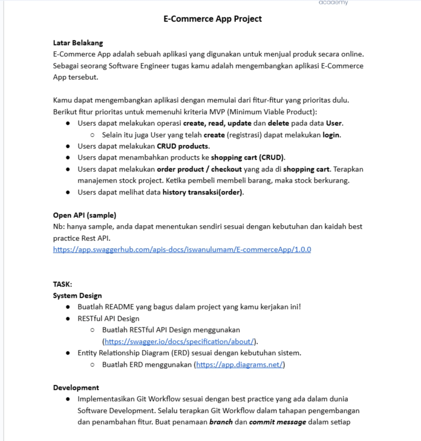
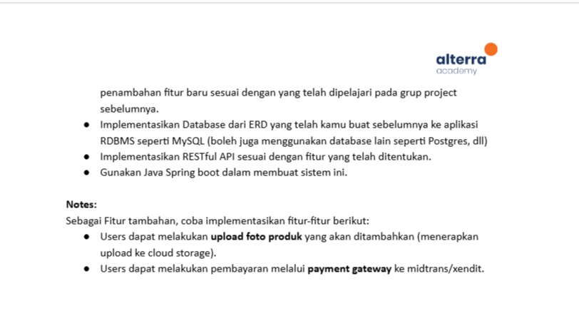
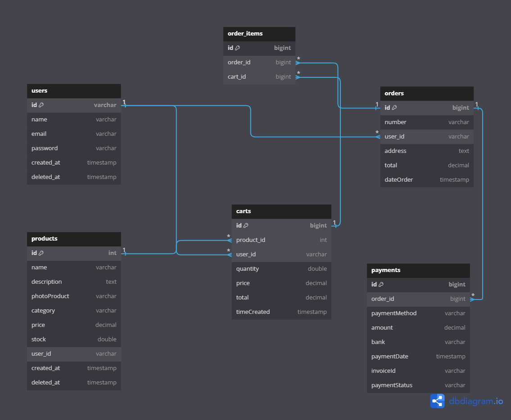

# E-Commerce Apps (Java)



## Tentang Aplikasi
Aplikasi E-Commerce ini dirancang untuk memudahkan transaksi jual beli produk secara online. Dibangun dengan menggunakan bahasa pemrograman Java, aplikasi ini menawarkan performa yang cepat dan stabil.

### Fitur Utama
- Autentikasi
    - Sign Up
    - Sign In
    - Refresh Token
- User
    - Get Profile User
    - Update User
    - Delete User
- Product
    - Create Product
    - Get All Product
    - Get Product By Id
    - Update Product
    - Delete Product
    - Update Product
- Cart
    - Add Product to Cart
    - Delete Product to Product
    - Get All Product to cart
    - Update Quantity Product
- Order
    - Create Order
    - Get History Order

# ERD


## Relasi Antar Tabel
* **User ke Product** -> One To Many
  - Satu user dapat memiliki banyak produk.
  - `products.user_id` merujuk ke `users.id`.
* **Product ke Cart** -> Many To One
  - Banyak item di keranjang merujuk ke satu produk.
  - `carts.product_id` merujuk ke `products.id`.
* **User ke Cart** -> One To Many
  - Satu user dapat memiliki banyak item di keranjang.
  - `carts.user_id` merujuk ke `users.id`.
* **User ke Order** -> One To Many
  - Satu user dapat membuat banyak pesanan.
  - `orders.user_id` merujuk ke `users.id`.
* **Order ke OrderItem** -> One To Many
  - Satu order dapat memiliki banyak order item.
  - `order_items.order_id` merujuk ke `orders.id`.
* **Cart ke OrderItem** -> Many To One
  - Banyak order item merujuk ke satu cart.
  - `order_items.cart_id` merujuk ke `carts.id`.
* **Order ke Payment** -> One To Many
  - Satu order dapat memiliki banyak pembayaran.
  - `payments.order_id` merujuk ke `orders.id`.


## Teknologi dan Stack yang Digunakan
* Bahasa Pemrograman: Java
* Framework: Spring Boot
* Database: MySQL
* ORM: Hibernate (JPA)
* Keamanan: Spring Security dengan JWT
* Build Tool: Maven
* Cloud Storage: Cloudinary
* Payment Gateway: Xendit

## Cara Menjalankan Aplikasi

### Prasyarat
Sebelum menjalankan aplikasi, pastikan kamu telah menginstal:
- **Java Development Kit (JDK) versi 11 atau terbaru**
- **Apache Maven**
- **Database MySQL**

### Instalasi
1. Klon repositori ini menggunakan Git:
   ```bash
   git clone https://github.com/lendral3n/E-Commerce_App.git
2. Masuk ke direktori aplikasi:
    ```bash
    cd E-Commerce_App
3. Buat database MySQL baru dan konfigurasikan `application.properties` sesuai dengan pengaturan database Anda.
    ```json
    spring.datasource.username= <USERNAME DB>
    spring.datasource.password= <PASSWORD DB>
    spring.datasource.url=jdbc:mysql://<HOST DB>:<PORT DB>/<NAME DB>
    spring.datasource.type=com.zaxxer.hikari.HikariDataSource
    spring.datasource.hikari.minimum-idle=10
    spring.datasource.hikari.maximum-pool-size=10
    spring.jpa.hibernate.ddl-auto=update
    ```
3. Konfigurasi JWT
    ```json
    jwt.refreshExpirationMs=360000000
    jwt.expirationMs=3600000
    jwt.secret=G6Y2ZV9DfGkQy9G3Y3F6jG6G1H7N2Q8H5V9ZJ6X9B1J3W5R9T2J5B6R7F9H8L2T6
    ```
3. Konfigurasi Cloudinary
    ```json
    cloudinary.cloud_name= <CLOUD NAME CLOUDINARY>
    cloudinary.api_key= <API KEY CLOUDINARY>
    cloudinary.api_secret= <API SECRET CLOUDINARY>
    ```
3. Konfigurasi Xendit
    ```json
    xendit.api.key= <XENDIT API KEY>
    ```
4. Untuk menjalankan server, gunakan perintah:
    ```bash
    mvn spring-boot:run

## List Endpoint

### Autentikasi
| Method | Endpoint             | Deskripsi             |
| ------ | -------------------- | --------------------- |
| POST   | /auth/signup         | Sign Up               |
| POST   | /auth/signin         | Sign In               |
| POST   | /auth/refreshToken   | Refresh Token         |

### User
| Method | Endpoint             | Deskripsi             |
| ------ | -------------------- | --------------------- |
| GET    | /api/users/profile   | Get Profile User      |
| PUT    | /api/users/profile   | Update User           |
| DELETE | /api/users/profile   | Delete User           |

### Product
| Method | Endpoint             | Deskripsi             |
| ------ | -------------------- | --------------------- |
| POST   | /api/products        | Create Product        |
| GET    | /api/products        | Get All Product       |
| GET    | /api/products/{id}   | Get Product By Id     |
| GET    | /api/products/users  | Get Product By user   |
| PUT    | /api/products/{id}   | Update Product        |
| DELETE | /api/products/{id}   | Delete Product        |

### Cart
| Method | Endpoint                     | Deskripsi                   |
| ------ | ---------------------------- | --------------------------- |
| POST   | /api/carts/{product_id}      | Add Product to Cart         |
| DELETE | /api/carts/{cart_id}         | Delete Product from Cart    |
| GET    | /api/carts                   | Get All Products in Cart    |
| PUT    | /api/carts/{cart_id}         | Update Quantity of Product in Cart |

### Order
| Method | Endpoint                     | Deskripsi                   |
| ------ | ---------------------------- | --------------------------- |
| POST   | /api/orders                  | Create Order                |
| GET    | /api/users/orders            | Get History Order           |

## >>>Sign Up<<<
**Request Body**
```json
{
  "name": "John Doe",
  "email": "johndoe@example.com",
  "password": "password123"
}
```
**Response**
```json
{
  "id": "generated_user_id",
  "name": "John Doe",
  "email": "johndoe@example.com",
  "createdAt": "2024-06-18T10:00:00Z"
}
```

## >>>Sign In<<<
**Request Body**
```json
{
  "email": "johndoe@example.com",
  "password": "password123"
}
```
**Response**
```json
{
  "accessToken": "generated_access_token",
  "refreshToken": "generated_refresh_token"
}
```

## >>>Refresh Token<<<
**Request Body**
```json
{
  "refreshToken": "refresh_token_from_signin_response"
}
```
**Response**
```json
{
  "accessToken": "newly_generated_access_token"
}
```

## >>>Get Profile User<<<
**Response**
```json
{
  "id": "user_id",
  "name": "John Doe",
  "email": "johndoe@example.com",
  "createdAt": "2024-06-18T10:00:00Z"
}
```

## >>>Update User<<<
**Request Body**
```json
{
  "name": "John Doe Jr.",
  "email": "johndoe@example.com"
}
```
**Response**
```json
{
  "id": "user_id",
  "name": "John Doe Jr.",
  "email": "johndoe@example.com",
  "createdAt": "2024-06-18T10:00:00Z"
}
```

## >>>Delete User<<<
**Response**
```json
{
  "messaged": "successfull delete user",
}
```

## >>>Create Product<<<
**Request Body Form**
```form
{
  "name": "Product A",
  "description": "Description of Product A",
  "file": "upload image",
  "category": "Category A",
  "price": 100.00,
  "stock": 50
}
```
**Response**
```json
{
  "id": "generated_product_id",
  "name": "Product A",
  "description": "Description of Product A",
  "file": "url_to_product_image",
  "category": "Category A",
  "price": 100.00,
  "stock": 50,
  "createdAt": "2024-06-18T10:00:00Z"
}
```

## >>>Update Product<<<
**Request Body Form**
```form
{
  "name": "Product A",
  "description": "Description of Product A",
  "file": "upload image",
  "category": "Category A",
  "price": 100.00,
  "stock": 50
}
```
**Response**
```json
{
  "id": "generated_product_id",
  "name": "Product A",
  "description": "Description of Product A",
  "file": "url_to_product_image",
  "category": "Category A",
  "price": 100.00,
  "stock": 50,
  "createdAt": "2024-06-18T10:00:00Z"
}
```

## >>>Delete Product<<<
**Response**
```json
{
  "message": "successfull delete product",
}
```

## >>>Get All Product<<<
**Response**
```json
{
    "message": "Semua produk berhasil ditemukan",
    "data": [
        {
            "id": 1,
            "name": "susus",
            "description": "susu murahs",
            "photoProduct": "http://res.cloudinary.com/dlxvvuhph/image/upload/v1718423569/u16le2cfhhpulqik5z4m.jpg",
            "category": "susus",
            "price": 10000.00,
            "stock": 87.0,
            "user": {
                "name": "lendr"
            }
        },
        {
            "id": 2,
            "name": "susus",
            "description": "susu murahs",
            "photoProduct": "http://res.cloudinary.com/dlxvvuhph/image/upload/v1718423573/ezo8p3z906jirlpr9wcc.jpg",
            "category": "susus",
            "price": 10000.00,
            "stock": 75.0,
            "user": {
                "name": "lendr"
            }
        },
        {
            "id": 4,
            "name": "sususs",
            "description": "susu murahss",
            "photoProduct": "http://res.cloudinary.com/dlxvvuhph/image/upload/v1718442736/krxwpus9fn2rmcbhznbs.png",
            "category": "sususs",
            "price": 10000.00,
            "stock": 99.0,
            "user": {
                "name": "lendr"
            }
        }
    ]
}
```
## >>>Get Product By ID<<<
**Response**
```json
{
    "message": "Semua produk berhasil ditemukan",
    "data": [
        {
            "id": 1,
            "name": "susus",
            "description": "susu murahs",
            "photoProduct": "http://res.cloudinary.com/dlxvvuhph/image/upload/v1718423569/u16le2cfhhpulqik5z4m.jpg",
            "category": "susus",
            "price": 10000.00,
            "stock": 87.0,
            "user": {
                "name": "lendr"
            }
        }
    ]
}
```
## >>>Get User Product<<<
**Response**
```json
{
    "message": "Semua produk berhasil ditemukan",
    "data": [
        {
            "id": 1,
            "name": "susus",
            "description": "susu murahs",
            "photoProduct": "http://res.cloudinary.com/dlxvvuhph/image/upload/v1718423569/u16le2cfhhpulqik5z4m.jpg",
            "category": "susus",
            "price": 10000.00,
            "stock": 87.0,
            "user": {
                "name": "lendr"
            }
        },
        {
            "id": 2,
            "name": "susus",
            "description": "susu murahs",
            "photoProduct": "http://res.cloudinary.com/dlxvvuhph/image/upload/v1718423573/ezo8p3z906jirlpr9wcc.jpg",
            "category": "susus",
            "price": 10000.00,
            "stock": 75.0,
            "user": {
                "name": "lendr"
            }
        }
    ]
}
```

## >>>Add Product to Cart<<<
**Request Body**
```json
{
  "productId": "product_id",
  "quantity": 2
}
```
**Response**
```json
{
  "id": "generated_cart_id",
  "productId": "product_id",
  "quantity": 2,
  "price": 100.00,
  "total": 200.00,
  "timeCreated": "2024-06-18T10:00:00Z"
}
```

## >>>Update Product to Cart<<<
**Request Body**
```json
{
  "productId": "product_id",
  "quantity": 2
}
```
**Response**
```json
{
  "id": "generated_cart_id",
  "productId": "product_id",
  "quantity": 2,
  "price": 100.00,
  "total": 200.00,
  "timeCreated": "2024-06-18T10:00:00Z"
}
```

## >>>Create Order<<<
**Request Body**
```json
{
  "address": "Shipping address for the order",
  "cartId": [3, 2],
  "bank": "bca"
}
```
**Response**
```json
{
  "id": "generated_order_id",
  "address": "Shipping address for the order",
  "total": 550.00,
  "dateOrder": "2024-06-18T10:00:00Z",
  "orderItems": [
    {
      "id": "order_item_id_1",
      "orderId": "generated_order_id",
      "productId": "product_id",
      "quantity": 3,
      "product": {
        "id": "product_id",
        "name": "Product A",
        "price": 100.00,
        "photoProduct": "url_to_product_image"
      }
    },
    {
      "id": "order_item_id_2",
      "orderId": "generated_order_id",
      "productId": "another_product_id",
      "quantity": 2,
      "product": {
        "id": "another_product_id",
        "name": "Another Product",
        "price": 150.00,
        "photoProduct": "url_to_another_product_image"
      }
    }
  ]
}
```

## >>>Get History Order<<<
**Response**
```json
{
    "message": "History order berhasil diambil",
    "data": [
        {
            "orderId": 4,
            "address": "123 Main St",
            "dateOrder": "2024-06-16T17:32:59.254+00:00",
            "total": 60000.00,
            "items": [
                {
                    "productId": 1,
                    "productName": "susus",
                    "quantity": 2.0,
                    "price": 10000.00,
                    "total": 20000.00
                },
                {
                    "productId": 2,
                    "productName": "susus",
                    "quantity": 4.0,
                    "price": 10000.00,
                    "total": 40000.00
                }
            ],
            "paymentStatus": "PENDING",
            "bank": "bca"
        },
        {
            "orderId": 5,
            "address": "123 Main St",
            "dateOrder": "2024-06-16T17:46:58.758+00:00",
            "total": 60000.00,
            "items": [
                {
                    "productId": 1,
                    "productName": "susus",
                    "quantity": 2.0,
                    "price": 10000.00,
                    "total": 20000.00
                },
                {
                    "productId": 2,
                    "productName": "susus",
                    "quantity": 4.0,
                    "price": 10000.00,
                    "total": 40000.00
                }
            ],
            "paymentStatus": "PENDING",
            "bank": "bri"
        }
    ]
}
```

## Kontributor
- **Lendra Syaputra** - BE 20 ALTA
  - [Github](https://github.com/lendral3n)
